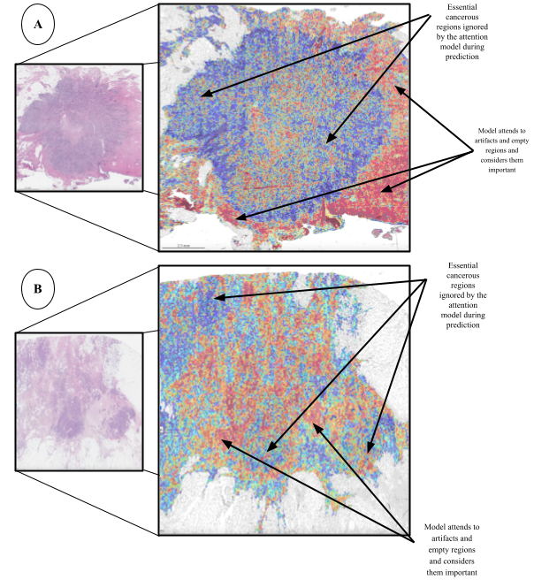
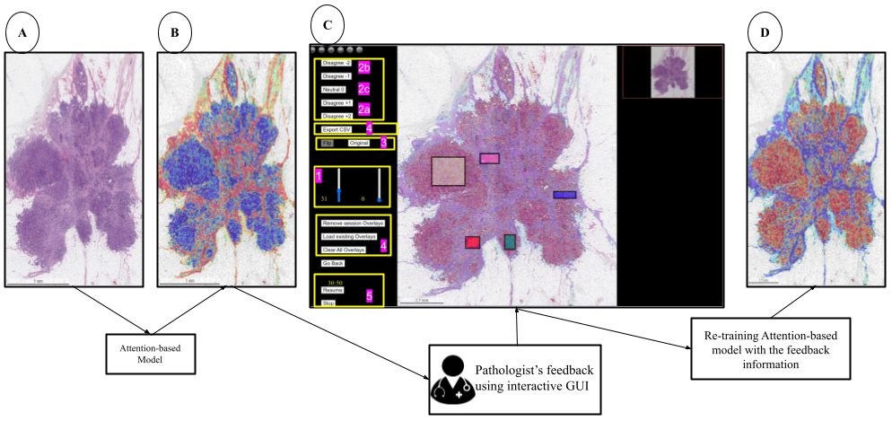

# A Closer Look at Weak Supervision’s Limitations in WSI Recurrence Score Prediction

### Summary



Histological examination and derived ancillary testing remain the gold standard for breast cancer diagnosis, prognosis assessment and treatment guidance. Currently, a commercial molecular signature test ONCOTYPEDX®, based on RNA quantitation and providing a recurrence score (RS) ranging from 0 to 100, is routinely utilized to predict the probabilities of response to chemotherapy and disease recurrence. We attempted to predict RS using digital pathology and weakly supervised AI models. In tissue samples, the malignant component is haphazardly admixed with the non-malignant component in variable proportions. This represents a challenge for weakly supervised attention-based models to identify high-valued diagnostic/prognostic areas within whole slide images (WSIs). 

After training traditional convolutional ([CLAM](https://github.com/mahmoodlab/CLAM)) and transformer ([TransMIL](https://github.com/szc19990412/TransMIL)) models on our in-house dataset, they exhibited a counterintuitive behaviour by emphasizing non-malignant features while neglecting the essential discriminative characteristics associated with tumoural regions and eventually misinterpretation. The visual representation in Fig illustrates issues with attention weights encountered in our initial attempt to classify <i>high</i> vs <i>low</i> RS. In <b>Fig A</b>, the heatmap for a WSI incorrectly classified as belonging to class <i>high</i> (actually <i>low</i>) displays a <i>negative picture</i> of attention (paying attention to non-tumoural component), understandably arising from the incorrect classification. Conversely, <b>Fig B</b> demonstrates the scenario where the WSI is correctly classified, yet the heatmap generated is also another <i>negative picture</i> of attention and unrelated to the class assignment. Numerous false-positive and false-negative errors become apparent, signalling the persistence of non-malignant features originating from non-tumoural areas or artifacts. 

To address this, we propose an interactive approach with a human in the middle by creating a user-friendly Graphical User Interface (GUI) that allows an expert pathologist to annotate heatmaps generated by any attention-based model. We aim to enhance the model’s learning capabilities and performance by incorporating the feedback from the GUI as expected scores in the successive training process. We train [CLAM](https://github.com/mahmoodlab/CLAM) and [TransMIL](https://github.com/szc19990412/TransMIL) on our in-house dataset before and after the expert feedback. We observe an improvement in RS prediction after retraining both models with the pathologist’s annotation- a 5% rise in validation-test AUC and 4% in validation-test accuracy for CLAM and a 4.5% increase in validation-test AUC and 3% in validation-test accuracy for TransMIL. 

Furthermore, we analyzed the generated heatmaps and observed how additional supervision from a domain expert enhanced the learning capacity of the models. We notice an improvement in cosine similarity between the pathologist’s GUI-based attention scores and trained models’ attention maps after feedback - 5% and 10% increase for CLAM and TransMIL, respectively. Our adaptive, interactive system harmonizes attention scores with expert intuition and instills higher confidence in the system’s predictions. This study establishes a potent synergy between AI and expert collaboration, addressing the constraints of weak supervision by enhancing the discrimination of diagnostic features and making an effort to generate predictions according to clinical diagnostic norms.

### Installation Guide

We perform experiments on a consumer-grade workstation equipped with the NVIDIA GeForce 3090 GPU. 

Create a [virtual environment](https://docs.python.org/3/library/venv.html) and run the following:

```
pip install -r requirements.txt
```

### Pre-processing

We follow pre-processing from [CLAM](https://github.com/mahmoodlab/CLAM)
```
#segmentation and create patches
'''
convert the images to HSV colour space and generate binary masks for tissue regions using thresholding of the saturation channel
extract 256 × 256 patches from the segmented foreground contours and store their coordinates
'''
python create_patches_fp.py --source DATA_DIRECTORY --save_dir RESULTS_DIRECTORY --patch_size 256 --seg --process_list CSV_FILE_NAME --patch --stitch

#extract features
'''
employ ImageNet pretrained ResNet50 that converts each patch into a 1024-dimensional feature vector representation
extracted features serve as inputs during the training
'''
CUDA_VISIBLE_DEVICES=0,1 python extract_features_fp.py --data_h5_dir DIR_TO_COORDS --data_slide_dir DATA_DIRECTORY --csv_path CSV_FILE_NAME --feat_dir FEATURES_DIRECTORY --batch_size 512 --slide_ext .svs

#create splits
python create_splits_seq.py --task task_2_tumor_subtyping  --k 10
```


### Details

1. Run the vanilla version of CLAM
   ```
   python main_vanilla_CLAM.py --drop_out --early_stopping --lr 2e-4 --k 10 --label_frac 1.0 --weighted_sample --bag_loss ce --inst_loss svm --model_type clam_mb --log_data --data_root_dir <base-data-dir>
   ```

2. Generate heatmaps using [create_heatmaps.py](https://github.com/mahmoodlab/CLAM/blob/master/create_heatmaps.py) from the CLAM repository. In addition, generate the reverse heatmaps (reversing the attention scores) using [create_heatmaps.py](https://github.com/mahmoodlab/CLAM/blob/master/create_heatmaps.py) from the CLAM repository with a small change [here](https://github.com/mahmoodlab/CLAM/blob/9482cbc72df522087cfbaa3e6b52da5207a7980a/wsi_core/WholeSlideImage.py#L623):
   ```
   if isinstance(cmap, str):
            cmap = plt.get_cmap(cmap)
            cmap = cmap.reversed()
   ```

4. Once both the versions of heatmaps are generated, save them in a CSV format. For instance, ```<your-heatmaps-csv-filename>.csv``` can be:
   
   | <b>name</b> | <b>webContentLink</b>   | 
   | :---:   | :---: | 
   | slide_0 | link-of-heatmap-of-slide_0 |
   | slide_1 | link-of-heatmap-of-slide_1 |
   | : | : |
   | slide_n | link-of-heatmap-of-slide_n |

   ```<your-reverse-heatmaps-csv-filename>.csv``` can be:

   | <b>name</b> | <b>webContentLink</b>   | 
   | :---:   | :---: | 
   | slide_0 | link-of-reverse-heatmap-of-slide_0 |
   | slide_1 | link-of-reverse-heatmap-of-slide_1 |
   | : | : |
   | slide_n | link-of-reverse-heatmap-of-slide_n |

5. To use the GUI, run
   ```
   #change the PWD to Heatmap_GUI/
   cd Heatmap_GUI

   #run the python script
   python deep_trial.py

   * Serving Flask app 'deep_trial'
   * Debug mode: off
   * Running on http://xxx.x.x.x:xxxx
   #local host address is not xxx.x.x.x:xxxx, it is subjective to your machine's sockets, ports and addresses
   ```
   Copy the address to any of your web browser and select any slide to annotate (as shown below in Fig <b>C</b>).

   
   <sup>
      <b>A</b>- the original WSI; <b>B</b>- initial heatmap generated by the attention-based model; <b>C</b>- interactive GUI for providing the feedback; <b>D</b>- heatmap of the
         WSI after incorporating the feedback <br>
         In C, notice that the GUI user has opted to reverse the heatmap using Flip button for annotation. This deliberate adjustment of altering the attention scores
         results in a heatmap in D that meets the desired criteria in C. <br>
         <i>NOTE</i>: The bounding boxes in C are drawn by the author, who is not a clinical expert. Different coloured boxes are for illustrative purposes only.
  </sup>

   The annotations from the GUI will be stored in your local drive in the following format as a CSV file
   
   | <b>flip</b> | <b>mode</b> | <b>rect_id</b> | <b>time_taken</b> | <b>x</b> | <b>y</b> | <b>width</b> | <b>height</b> | <b>actual_x</b> | <b>actual_y</b> | <b>actual_width</b> | <b>actual_height</b> | 
   | :---:   | :---: | :---:   | :---: | :---:   | :---: | :---:   | :---: | :---:   | :---: | :---:   | :---: | 
   |1|-2|101|27|157.7179501946301|-118.6537331113636|11479.748733776718|39363.37628015853|0.0027278347607082587|-0.0020521936613401293|0.1985497376902819|0.6808152526922158|
   | : | : | : | : | : | : | : | : | : | : | : | : |
   | : | : | : | : | : | : | : | : | : | : | : | : |
   |1|1|10n|75|23977.454291044796|25213.917910447766|14535.082089552236|8572.732542180302|0.41470570222153647|0.43609114653650705|0.251393719768104|0.14827099765090979|
   
6. After completing the annotations, we determine the patches enclosed within each bounding box and extract their associated top-left patch coordinate information and box mode (increase, decrease, or maintain the same score). We apply thin spline interpolation with a fixed mapping: $z=f(x,y)$; 

   $x=[0,0,0,  0,  0,  1, 1, 1,  1,  1, 0.5, 0.5, 0.5, 0.5, 0.5]$, 

   $y=[0,-1, -2,  1,  2,  0, 1, 2, -1, -2,   0,   -1,   -2,   1,    2]$,

   $z=[0,0,0,0.4,1,1,1,1,0.6,0,0.5,0.35,0,0.65,1]$;

   where, $x$ = Normalized attention scores, $y$ = bounding box modes and $z$ = interpolated scores.

   Perform thin spline interpolation on the acquired annotations:
   ```
   cd thin_spline_interpolation

   #perform co-ordinates mapping to grab the patches covered by every bounding box drawn
   python tps_map_coordinates.py

   #after grabbing the patches, perfrom thin spline interpolation to generate the expected attention scores
   python tps_interpolation.py
   python tps_interpolation_processing.py
   python tps_coordinates.py
   ```
   
   Sample of the CSV file after interpolation with the <b>expected scores</b>

   | <b>coords_x</b>| <b>coords_y</b>| <b>z</b>|
   | :---:   | :---: | :---: | 
   | coord_x_0 | coord_y_0 | z_0 |
   | coord_x_1 | coord_y_1 | z_1 |
   | : | : |
   | coord_x_n | coord_y_n | z_n |

      After correcting the initial WSI heatmap by the pathologist, this representation (<b>expected scores</b>) works as a diagnostic attention map according to the clinician’s standards. In other words, the heatmap of a WSI generated from vanilla attention-models, combined with the corrections, serves as a universal model-independent representation of that WSI. 

7. The interpolation is clipped between the values 0 and 1 to ensure coherence and store the patch coordinates and the new attention scores after interpolation (<b>expected scores</b>) in a CSV file. We incorporate the feedback for every WSI into the model’s learning process through a least squares error correction (MSE loss) to penalize the difference between the <b>expected scores</b> and the model’s generated attention scores during the learning process (<i>current scores</i>). 
   
   $L_{total} = L_{model} + {\lambda}L_{feedback}$
   
   $L_{model}$ represents existing loss function(s) in any attention-based model; <br>
   $L_{feedback}$ represents the MSE loss for feedback; <br>
   ${\lambda}$ represents the coefficient of the MSE term; <br>
   $L_{total}$ represents the cumulative or gross loss for the attention-based model. <br>
   
   We maintain the CLAM's and TransMIL's original loss functions without alteration during the validation and testing phases.<br>

   Run the feedback version of CLAM
   ```
   python main_feedback_CLAM.py --drop_out --early_stopping --k 10 --label_frac 1.0 --weighted_sample --bag_loss ce --inst_loss svm --model_type clam_mb --log_data --data_root_dir <base-data-dir>
   ```

   Similarly, <br>
   Run the vanilla version of TransMIL
   ```
   python main_vanilla_TRANSMIL.py --drop_out --early_stopping --lr 2e-6 --k 10 --label_frac 1.0 --weighted_sample  --model_type transmil --log_data --data_root_dir <base-data-dir>
   ```

   Using the universal, model-independent representation of WSI  in the form of <b>expected scores</b>, run the feedback version of TransMIL
   ```
   python main_feedback_TRANSMIL.py --drop_out --early_stopping --k 10 --label_frac 1.0 --weighted_sample  --model_type transmil --log_data --data_root_dir <base-data-dir>
   ```

   For our in-house dataset:

   | <b>Model</b>| <b>Feedback</b>| <b>Test AUC</b>| <b>Val AUC </b>| <b>Test Acc </b>| <b>Val Acc </b>| <b> Cosine Similarity </b> |
   | :---:   | :---: | :---: | :---: | :---: | :---: | :---: | 
   | CLAM | After | 0.781 $\pm$ 0.055 | 0.819 $\pm$ 0.050 | 0.824 $\pm$ 0.046 | 0.839 $\pm$ 0.031 | 0.861 |
   | CLAM | Before | 0.731 $\pm$ 0.064 | 0.756 $\pm$ 0.058| 0.786 $\pm$ 0.056 | 0.8012 $\pm$ 0.039  | 0.810 |


   | <b>Model</b>| <b>Feedback</b>| <b>Test AUC</b>| <b>Val AUC </b>| <b>Test Acc </b>| <b>Val Acc </b>| <b> Cosine Similarity </b> |
   | :---:   | :---: | :---: | :---: | :---: | :---: | :---: | 
   | TransMIL | After | 0.813 $\pm$ 0.066 | 0.8344 $\pm$ 0.049 | 0.8463 $\pm$ 0.032  | 0.8554 $\pm$ 0.015 | 0.866 |
   | TransMIL | Before | 0.778 $\pm$ 0.055 | 0.8191 $\pm$ 0.053 | 0.7718 $\pm$ 0.029| 0.8243 $\pm$ 0.036 | 0.769 |


   Our findings are consistent with the [current literature](https://www.sciencedirect.com/science/article/abs/pii/S1361841522002808) with its comparable performance of <i>0.85</i> on [TCGA-BR](https://www.cancer.gov/ccg/research/genome-sequencing/tcga/studied-cancers) subtyping. Our recurrence-score dataset encompasses approximately 700 images, slightly smaller than TCGA-BR, that comprises 1100 images featuring breast cancer lobular and ductal carcinomas. Additionally, the marginally diminished performance of CLAM and TransMIL without expert feedback could partly result from using an off-the-shelf [Image-Net](https://www.image-net.org/) pre-trained ResNet50 network for feature extraction, not optimally tailored for the histopathological recurrence score tasks.

   Although we have chosen a strong-supervised approach for our study, we acknowledge the potential merits of strategies such as transfer learning from public datasets and unsupervised domain adaptation. Our emphasis was on exploring the integration of expert feedback into attention-based models for enhanced comprehension and performance on our in-house dataset. We recognize the successes of transfer learning and domain-specific adaptations in various contexts. Their potential benefits, though unexplored in our study, could prove valuable in refining and extending the capabilities of our dynamic and adaptive approach with a pathologist’s supervision for offering new perspectives and contributing to the field.
